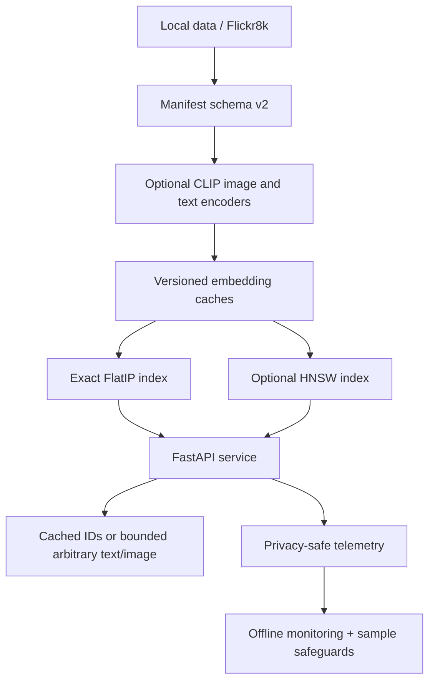

# Architecture

## System overview

The system is artifact-first: ingestion creates a canonical manifest, optional encoders create a
versioned embedding cache, retrieval builders persist indexes, and the service validates every
artifact boundary before accepting traffic. Neural dependencies are absent from the default
release-check path.

## Layers and boundaries

The ingestion layer accepts canonical CSV, local image/caption directories, and opt-in Flickr8k
sources. Schema v2 separates `image_id` from globally unique `caption_id`: one image can have many
captions, while all rows for an image share path and split. Image-group splitting prevents captions
for the same image crossing split boundaries.

The optional CLIP layer produces L2-normalized image and text embeddings. Caches bind backend,
model/revision, dataset and manifest fingerprints, split, counts, and dimension. Index metadata
binds the same identity to ordered candidates. The service rejects missing or incompatible
artifacts; it never rebuilds them automatically.

FlatIP is the exact normalized-inner-product correctness reference. HNSW is a bounded optional
approximation with explicit construction and `efSearch` settings. Exact reranking was evaluated
but did not alter `IndexHNSWFlat` candidate rankings because that index already stores exact vectors;
it was not promoted.

FastAPI supports cached caption-to-image and image-to-caption retrieval. Optional arbitrary text
and image inference is bounded by model compatibility, local-files-only behavior, query/upload
limits, format validation, and in-memory caches. `/health` is liveness; `/ready` reports validated
artifact and optional encoder readiness.

Telemetry records operational fields, hashed identifiers, score summaries, and labeled metrics
when available—never raw text or uploaded image bytes. Offline monitoring aggregates JSONL and
requires minimum samples before making health decisions.

The contrastive-adapter experiment operated on frozen CLIP caches and selected on validation only.
Its bidirectional MRR declined, so zero-shot CLIP remains promoted. The official test results were
not used during adapter development.

Generated datasets, images, embedding caches, FAISS binaries, checkpoints, and telemetry belong
under ignored artifact/data/log boundaries. Deterministic Markdown/JSON result summaries are the
tracked scientific record. Base, serving/FAISS, neural, dataset, and training dependencies remain
separate extras so non-neural verification stays small.
